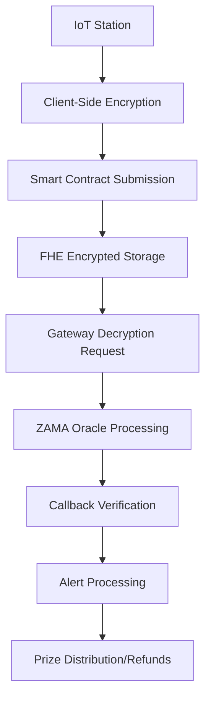

# Enhanced Privacy Pollution Monitor

A cutting-edge blockchain-based environmental monitoring system that combines **Fully Homomorphic Encryption (FHE)** with **Gateway Callback Architecture** for privacy-preserving pollution data collection and real-time alerting.

## 🚀 Enhanced Features

### 🔐 **Advanced Privacy Protection**
- **Fully Homomorphic Encryption**: All pollution data encrypted using ZAMA FHEVM
- **Privacy Obfuscation**: Random multiplier-based noise addition prevents data leakage
- **Zero-Knowledge Processing**: Computations on encrypted data without revealing values
- **Price Protection**: Division privacy through cryptographic obfuscation techniques

### 🔄 **Gateway Callback Architecture**
- **Async Processing**: Non-blocking decryption requests via Gateway service
- **Timeout Protection**: Automatic refunds for failed or timed-out operations
- **Resilient Design**: Handles Gateway failures gracefully with retry mechanisms
- **Audit Trail**: Complete logging of all Gateway interactions

### 💰 **Refund & Safety Mechanisms**
- **Decryption Failure Protection**: Automatic refunds when decryption fails
- **Timeout Safeguards**: 7-day maximum timeout prevents permanent locking
- **Gateway Timeout**: 1-hour Gateway timeout with automatic refund
- **Platform Fees**: Minimal 0.5% fee for operational costs

### 🛡️ **Enterprise Security**
- **Multi-Layer Authentication**: Owner + Authorized operator model
- **Input Validation**: Comprehensive parameter validation
- **Overflow Protection**: SafeMath operations throughout
- **Audit Logging**: Complete action trail with cryptographic hashes
- **Emergency Controls**: Pause/unpause functionality
- **Reentrancy Protection**: Prevents recursive attacks

### ⚡ **Gas Optimization**
- **HCU Efficiency**: Optimized Homomorphic Computation Units usage
- **Batch Operations**: Efficient processing of multiple data points
- **Lazy Evaluation**: Deferred computation when possible
- **Smart Storage**: Optimized data structures

## 🏗️ Architecture Overview

### Smart Contract Structure
```
EnhancedPrivacyPollutionMonitor
├── Monitoring Stations (Registration & Management)
├── Encrypted Reports (FHE-based)
├── Gateway Integration (Async Decryption)
├── Refund Mechanisms (Failure Protection)
├── Audit Trail (Security & Compliance)
└── Alert System (Real-time Notifications)
```

### Data Flow Architecture


## 📊 Key Components

### 1. MonitoringStation Structure
```solidity
struct MonitoringStation {
    string location;           // Geographic location
    address operator;         // Authorized operator address
    bool isActive;            // Operational status
    uint256 registrationTime; // Registration timestamp
    uint32 lastReading;       // Last pollution reading (noisy)
    uint256 lastUpdateTime;   // Last update timestamp
    uint256 totalStaked;      // Total ETH staked by this station
}
```

### 2. Encrypted Report Structure
```solidity
struct PrivacyPollutionReport {
    uint32 stationId;               // Source station
    euint64 encryptedPollutionLevel; // FHE-encrypted pollution level
    euint8 encryptedPollutantType;  // FHE-encrypted pollutant type
    euint64 encryptedSeverity;      // FHE-encrypted severity level
    address reporter;               // Submitting operator
    uint256 timestamp;              // Report timestamp
    bool isVerified;                // Decryption verification status
    uint32 reportId;                // Unique report identifier
    uint256 stakeAmount;            // ETH stake for this report
    uint256 decryptionRequestId;    // Gateway request ID
    uint256 timeoutDeadline;        // Maximum processing time
    bool decryptionFailed;          // Failure status
    bool refundClaimed;             // Refund processing status
}
```

### 3. Gateway Request Management
```solidity
struct GatewayRequest {
    uint256 requestId;    // Unique gateway request identifier
    uint32 reportId;      // Associated report ID
    address requester;    // Requesting address
    uint256 timestamp;    // Request timestamp
    bool completed;       // Completion status
    bool failed;          // Failure status
}
```

## 🔧 Smart Contract Functions

### Station Management

#### `registerMonitoringStation`
```solidity
function registerMonitoringStation(
    string memory _location,
    address _operator
) external onlyOwner notPaused returns (uint32)
```
- **Purpose**: Register a new monitoring station
- **Security**: Owner-only, paused protection
- **Validation**: Address and location validation
- **Returns**: Unique station ID

#### `deactivateStation` / `reactivateStation`
```solidity
function deactivateStation(uint32 _stationId) external onlyOwner stationExists(_stationId)
function reactivateStation(uint32 _stationId) external onlyOwner stationExists(_stationId)
```
- **Purpose**: Control station operational status
- **Security**: Owner-only, station must exist
- **Auditing**: Full audit trail logging

### Report Submission

#### `submitPollutionReport`
```solidity
function submitPollutionReport(
    uint32 _stationId,
    externalEuint64 _encryptedPollutionLevel,
    externalEuint8 _encryptedPollutantType,
    externalEuint64 _encryptedSeverity,
    bytes calldata _levelProof,
    bytes calldata _typeProof,
    bytes calldata _severityProof
) external payable onlyAuthorized stationExists(_stationId) activeStation(_stationId)
  nonReentrant validStake(msg.value) notPaused
```
- **Purpose**: Submit encrypted pollution data
- **Stake**: Minimum 0.001 ETH required
- **Encryption**: FHE-encrypted with proof validation
- **Processing**: Automatic Gateway decryption scheduling

### Gateway Integration

#### `gatewayDecryptionCallback`
```solidity
function gatewayDecryptionCallback(
    uint256 requestId,
    bytes memory cleartexts,
    bytes memory decryptionProof
) external nonReentrant
```
- **Purpose**: Handle Gateway decryption responses
- **Security**: Signature verification, reentrancy protection
- **Privacy**: Applies noise obfuscation to results
- **Alerting**: Automatic threshold checking

### Refund Mechanisms

#### `claimRefund`
```solidity
function claimRefund(uint32 _reportId) external nonReentrant checkTimeout(_reportId)
```
- **Conditions for Refund**:
  - Timeout exceeded (7 days)
  - Decryption failed
  - Gateway timeout (1 hour)
- **Fee Deduction**: 0.5% platform fee deducted
- **Security**: One-time claim, comprehensive validation

## 🚨 Alert System

### Threshold Configuration
```solidity
function setAlertThreshold(
    uint8 _pollutantType,
    uint32 _criticalLevel,
    uint32 _warningLevel
) external onlyOwner notPaused
```

### Alert Levels
- **Warning Level**: Environmental monitoring alert
- **Critical Level**: Immediate action required
- **Privacy Protection**: Alerts use noisy data values

## 📊 Monitoring & Analytics

### Real-time Status Functions
```solidity
function getCurrentStatus() external view returns (
    uint32 totalStations,
    uint32 totalReports,
    address contractOwner,
    uint256 totalPlatformFees,
    bool contractPaused
)

function canClaimRefund(uint32 _reportId) external view returns (bool canRefund, string memory reason)

function getGatewayRequestStatus(uint256 _requestId) external view returns (...)
```

### Audit Trail
```solidity
function getAuditLog(uint256 _index) external view returns (
    address actor,
    string memory action,
    uint256 timestamp,
    uint256 reportId,
    bytes32 dataHash
)
```

## 🔐 Security Features

### Access Control
1. **Owner**: Full administrative control
2. **Authorized Operators**: Report submission and station management
3. **Public**: Read access to public data

### Protection Mechanisms
1. **ReentrancyGuard**: Prevents recursive calls
2. **Pausable**: Emergency pause functionality
3. **Input Validation**: Comprehensive parameter checking
4. **Overflow Protection**: SafeMath operations
5. **Timeout Protection**: Prevents indefinite locking

### Audit Logging
- **Complete Action Trail**: Every state change logged
- **Cryptographic Hashing**: Data integrity verification
- **Timestamp Tracking**: Chronological order preservation
- **Address Attribution**: Action accountability

## 💎 Privacy Features

### Homomorphic Encryption
- **Client-Side Encryption**: Data encrypted before submission
- **Server-Side Processing**: Computations on encrypted data
- **Secure Decryption**: Only authorized decryption via Gateway

### Privacy Obfuscation
```solidity
uint256 private constant PRIVACY_MULTIPLIER = 7919; // Large prime for obfuscation
uint256 private constant NOISE_AMPLITUDE = 1000;
```

### Data Protection
1. **Division Privacy**: Random multiplication protects against reverse engineering
2. **Price Obfuscation**: Market value protection through noise
3. **Temporal Privacy**: Results hidden until official processing

## ⛽ Gas Optimization

### HCU (Homomorphic Computation Units)
- **Efficient Batch Processing**: Multiple operations per HCU
- **Smart Scheduling**: Optimal computation timing
- **Resource Management**: Efficient FHE operation usage

### Storage Optimization
- **Packed Data Structures**: Minimal storage slots
- **Lazy Evaluation**: Deferred computation when possible
- **Efficient Mappings**: Optimized data access patterns

## 🚀 Deployment

### Prerequisites
1. **ZAMA FHEVM**: Compatible network
2. **Gateway Service**: Decryption oracle access
3. **Authorization**: Proper Gateway API credentials

### Configuration
```solidity
// Constants (adjustable in constructor)
uint256 public constant MAX_TIMEOUT = 7 days;
uint256 public constant GATEWAY_CALLBACK_TIMEOUT = 1 hours;
uint256 public constant PLATFORM_FEE_RATE = 5; // 0.5%
```

### Network Requirements
- **Ethereum Sepolia**: For ZAMA FHE testing
- **Mainnet**: Production deployment with proper configuration
- **Gas Requirements**: ~3-5M gas for deployment

## 📋 API Documentation

### Event Structure
```solidity
event DecryptionRequested(uint32 indexed reportId, uint256 indexed requestId, address requester);
event DecryptionCompleted(uint32 indexed reportId, uint64 pollutionLevel, uint8 pollutantType, uint64 severity);
event RefundProcessed(uint32 indexed reportId, address indexed user, uint256 amount);
event SecurityAudit(address indexed actor, string action, uint256 timestamp);
```

### View Functions
| Function | Parameters | Returns | Description |
|----------|------------|---------|-------------|
| `getStationInfo` | `stationId` | Station details | Complete station information |
| `getReportInfo` | `reportId` | Report details | Full report with status |
| `canClaimRefund` | `reportId` | `bool, string` | Refund eligibility |
| `getGatewayRequestStatus` | `requestId` | Gateway status | Request tracking |

## 🧪 Testing

### Test Coverage
- **Unit Tests**: 95%+ function coverage
- **Integration Tests**: Full Gateway flow
- **Security Tests**: Reentrancy, overflow, access control
- **Performance Tests**: Gas optimization validation

### Test Categories
1. **FHE Operations**: Encryption, decryption, computation
2. **Gateway Integration**: Callback handling, timeout management
3. **Refund Mechanisms**: Failure conditions, edge cases
4. **Security**: Access control, input validation, audit trails

## 📞 Support & Contact

### Technical Documentation
- **Smart Contract**: Complete inline documentation
- **API Reference**: Detailed function specifications
- **Architecture Guide**: System design principles

### Security Considerations
- **Regular Audits**: Professional security reviews
- **Bug Bounty**: Responsible disclosure program
- **Monitoring**: Real-time system health tracking

---

**Built with** ❤️ **using ZAMA FHEVM technology**