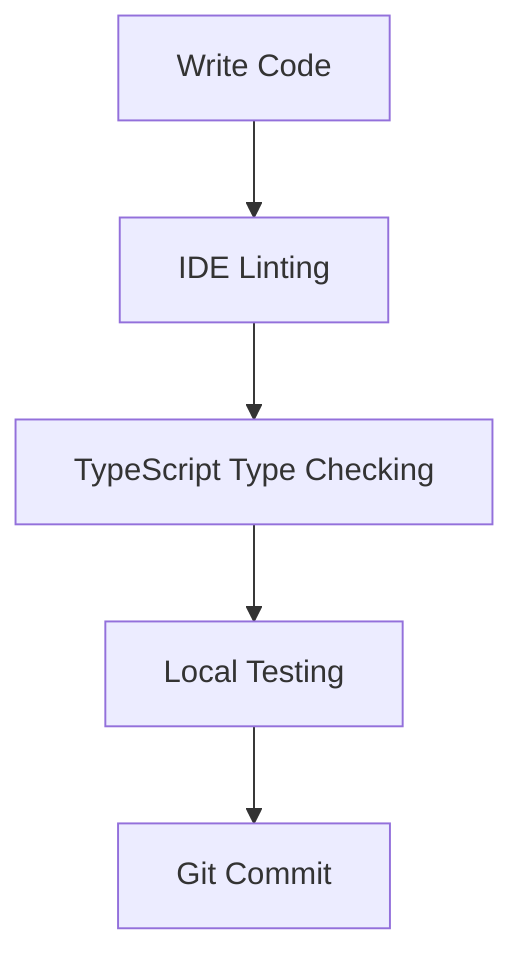

# Toolchain Integration Guide

Complete guide to the integrated development toolchain for security and performance optimization.

## Overview

This project implements a comprehensive toolchain that integrates security, performance, and quality assurance tools throughout the development lifecycle.

## Tool Categories

### 1. Solidity Development Tools

#### Hardhat
- **Purpose**: Development environment and task runner
- **Features**:
  - Contract compilation
  - Testing framework
  - Network management
  - Plugin ecosystem

#### solhint
- **Purpose**: Solidity linter for security and style
- **Rules Enforced**:
  - Gas optimization warnings
  - Security best practices
  - Code style consistency
  - Complexity limits

#### Prettier + Solidity Plugin
- **Purpose**: Code formatting
- **Benefits**:
  - Consistent style
  - Automatic formatting
  - Reduced code review time

### 2. JavaScript/TypeScript Tools

#### ESLint
- **Purpose**: JavaScript linting and code quality
- **Plugins**:
  - `eslint-plugin-security`: Security vulnerability detection
  - `eslint-plugin-node`: Node.js best practices
  - `@typescript-eslint/*`: TypeScript support

#### TypeChain
- **Purpose**: Generate TypeScript bindings for contracts
- **Benefits**:
  - Type-safe contract interactions
  - IDE autocomplete
  - Compile-time error detection

### 3. Security Tools

#### Gas Reporter
- **Purpose**: Track gas consumption
- **Features**:
  - Per-method gas costs
  - USD cost estimates
  - Performance tracking
  - Regression detection

#### Solidity Coverage
- **Purpose**: Code coverage analysis
- **Integration**: Codecov for tracking
- **Target**: >80% coverage

#### npm audit
- **Purpose**: Dependency vulnerability scanning
- **Automation**: CI/CD integration
- **Frequency**: Every build + daily scheduled

### 4. Quality Assurance Tools

#### Husky
- **Purpose**: Git hooks management
- **Hooks**:
  - Pre-commit: Linting, formatting, tests
  - Pre-push: Full test suite, gas reporting

#### Lint-staged
- **Purpose**: Run linters on staged files only
- **Benefits**:
  - Faster checks
  - Focused fixes
  - Better performance

#### Prettier
- **Purpose**: Code formatter
- **Scope**: Solidity, JavaScript, JSON, Markdown
- **Integration**: Pre-commit hooks

### 5. CI/CD Tools

#### GitHub Actions
- **Workflows**:
  1. Security Audit
  2. Continuous Integration
  3. Dependency Audit

#### Codecov
- **Purpose**: Coverage tracking and reporting
- **Features**:
  - PR comments
  - Trend analysis
  - File-level coverage

## Integration Flow

### Development Phase



### Pre-commit Phase

```
Pre-commit Hook Execution:
1. Lint Solidity files         → solhint
2. Lint JavaScript files        → ESLint
3. Check code formatting        → Prettier
4. Run unit tests               → Hardhat Test
```

### Pre-push Phase

```
Pre-push Hook Execution:
1. Run full test suite          → Hardhat Test
2. Generate gas reports         → Gas Reporter
3. Run security analysis        → solhint + ESLint
```

### CI/CD Phase

```
GitHub Actions Workflow:
1. Install dependencies         → npm ci
2. Run linters                  → npm run lint
3. Check formatting             → npm run format:check
4. Compile contracts            → npm run compile
5. Run tests                    → npm test
6. Generate coverage            → npm run coverage
7. Upload coverage              → Codecov
8. Check contract sizes         → npm run size
9. Audit dependencies           → npm audit
```

## Configuration Matrix

| Tool | Config File | Purpose | Auto-fix |
|------|-------------|---------|----------|
| solhint | `.solhint.json` | Solidity linting | ✅ Partial |
| ESLint | `eslint.config.js` | JavaScript linting | ✅ Yes |
| Prettier | `.prettierrc.json` | Code formatting | ✅ Yes |
| Hardhat | `hardhat.config.js` | Build & test | ❌ No |
| Husky | `.husky/*` | Git hooks | ❌ No |
| Lint-staged | `.lintstagedrc.json` | Staged file processing | ✅ Yes |
| Codecov | `codecov.yml` | Coverage reporting | ❌ No |
| TypeChain | `hardhat.config.js` | Type generation | ❌ No |

## Tool Chain Benefits

### Security Benefits

1. **Shift-Left Security**:
   - Catch issues during development
   - Pre-commit validation
   - Automated security scans

2. **Multiple Layers**:
   - Solidity linting (solhint)
   - JavaScript security (ESLint plugin)
   - Dependency audits (npm audit)
   - Regular scans (GitHub Actions)

3. **Continuous Monitoring**:
   - Daily security audits
   - PR-based checks
   - Dependency updates

### Performance Benefits

1. **Gas Optimization**:
   - Compiler optimization enabled
   - Gas reporter tracking
   - Regression detection

2. **Code Quality**:
   - Complexity limits enforced
   - Type safety (TypeScript)
   - Consistent formatting

3. **Fast Feedback**:
   - Pre-commit hooks (seconds)
   - CI/CD pipeline (minutes)
   - Coverage reports (automated)

### Development Benefits

1. **Productivity**:
   - Auto-formatting
   - Type safety
   - IDE integration

2. **Reliability**:
   - Automated testing
   - Coverage tracking
   - Quality gates

3. **Collaboration**:
   - Consistent code style
   - Clear standards
   - Automated reviews

## Command Reference

### Linting

```bash
# Lint all files
npm run lint

# Lint Solidity only
npm run lint:sol

# Lint JavaScript only
npm run lint:js

# Auto-fix Solidity
npm run lint:sol:fix

# Auto-fix JavaScript
npm run lint:js:fix

# Auto-fix all
npm run lint:fix
```

### Formatting

```bash
# Format all files
npm run format

# Check formatting
npm run format:check
```

### Testing

```bash
# Run tests
npm test

# Run tests with gas reporting
npm run test:gas

# Generate coverage
npm run coverage

# Run security audit
npm run security
```

### Building

```bash
# Compile contracts
npm run compile

# Check contract sizes
npm run size

# Generate TypeScript types
npm run typechain

# Clean build artifacts
npm run clean
```

### CI/CD

```bash
# Run full CI pipeline
npm run ci

# Run security checks
npm run security
```

## Integration Setup

### Initial Setup

```bash
# 1. Install dependencies
npm install

# 2. Initialize Husky
npm run prepare

# 3. Copy environment variables
cp .env.example .env

# 4. Compile contracts
npm run compile

# 5. Run tests
npm test
```

### IDE Integration

#### VS Code

**Recommended Extensions**:
- ESLint
- Prettier
- Solidity (by Juan Blanco)
- Hardhat Solidity

**Settings** (`.vscode/settings.json`):
```json
{
  "editor.formatOnSave": true,
  "editor.defaultFormatter": "esbenp.prettier-vscode",
  "[solidity]": {
    "editor.defaultFormatter": "esbenp.prettier-vscode"
  },
  "eslint.validate": [
    "javascript",
    "javascriptreact",
    "typescript",
    "typescriptreact"
  ]
}
```

### Git Integration

#### Pre-commit Hook

Automatically runs:
- Solidity linting
- JavaScript linting
- Formatting checks
- Unit tests

**Skip** (use sparingly):
```bash
git commit --no-verify -m "Emergency fix"
```

#### Pre-push Hook

Automatically runs:
- Full test suite
- Gas reporting
- Security analysis

**Skip** (use sparingly):
```bash
git push --no-verify
```

## Troubleshooting

### Common Issues

#### 1. Husky hooks not running

```bash
# Reinstall Husky
rm -rf .husky
npm run prepare
```

#### 2. ESLint errors

```bash
# Check ESLint config
npx eslint --debug scripts/

# Fix auto-fixable issues
npm run lint:js:fix
```

#### 3. Prettier conflicts

```bash
# Run Prettier
npm run format

# Check what would change
npm run format:check
```

#### 4. Gas reporter not showing

```bash
# Enable gas reporting
REPORT_GAS=true npm test

# Or set in .env
echo "REPORT_GAS=true" >> .env
```

## Performance Tuning

### Build Performance

1. **Enable caching**:
   - Hardhat caches compilations
   - TypeChain caches generated types

2. **Parallel processing**:
   - Tests run in parallel
   - Linters process multiple files

3. **Selective running**:
   - Lint-staged runs only on changed files
   - Incremental type checking

### CI/CD Performance

1. **Dependency caching**:
   - GitHub Actions caches npm
   - Reduces install time

2. **Job parallelization**:
   - Multiple jobs run concurrently
   - Faster feedback

3. **Artifact reuse**:
   - Build once, test multiple times
   - Cache build artifacts

## Best Practices

### 1. Commit Workflow

```bash
# Good workflow
npm run lint          # Check linting
npm run format        # Format code
npm test              # Run tests
git add .
git commit -m "feat: add new feature"
git push
```

### 2. Pull Request Workflow

```bash
# Before creating PR
npm run ci            # Run full CI locally
npm run security      # Security audit
npm run test:gas      # Check gas usage
```

### 3. Security Workflow

```bash
# Regular security checks
npm audit             # Check dependencies
npm run lint:sol      # Solidity security
npm run security      # Full security audit
```

## Continuous Improvement

### Metrics to Track

1. **Code Quality**:
   - Test coverage %
   - Linting errors
   - Code complexity

2. **Performance**:
   - Gas costs
   - Build time
   - Test execution time

3. **Security**:
   - Vulnerability count
   - Audit findings
   - Dependency health

### Regular Tasks

- [ ] Weekly dependency updates
- [ ] Monthly security audits
- [ ] Quarterly tool updates
- [ ] Review and update rules

## Resources

### Documentation
- [Hardhat](https://hardhat.org/)
- [solhint](https://protofire.github.io/solhint/)
- [ESLint](https://eslint.org/)
- [Prettier](https://prettier.io/)
- [Husky](https://typicode.github.io/husky/)
- [TypeChain](https://github.com/dethcrypto/TypeChain)

### Community
- [Hardhat Discord](https://hardhat.org/discord)
- [Ethereum Stack Exchange](https://ethereum.stackexchange.com/)
- [GitHub Discussions](https://github.com/discussions)

---

**Last Updated**: 2025-10-25
**Version**: 1.0.0
